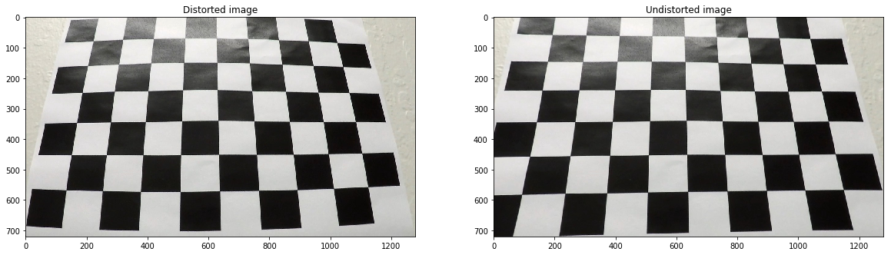
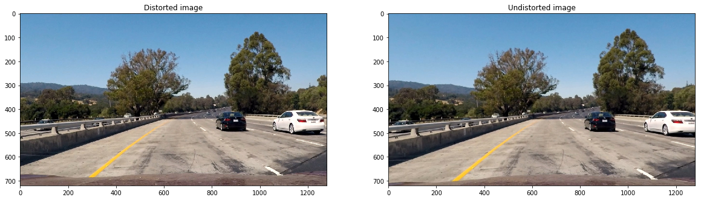
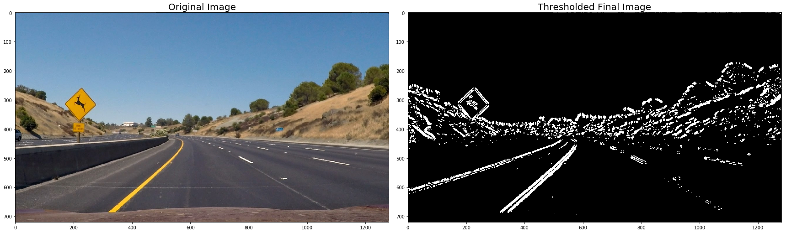
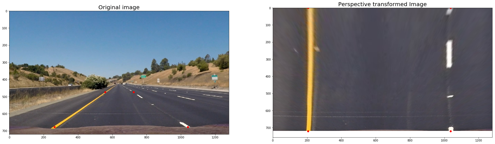
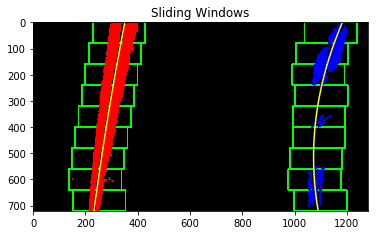
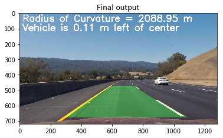

## Writeup Template

---

**Advanced Lane Finding Project**

The goals / steps of this project are the following:

* Compute the camera calibration matrix and distortion coefficients given a set of chessboard images.
* Apply a distortion correction to raw images.
* Use color transforms, gradients, etc., to create a thresholded binary image.
* Apply a perspective transform to rectify binary image ("birds-eye view").
* Detect lane pixels and fit to find the lane boundary.
* Determine the curvature of the lane and vehicle position with respect to center.
* Warp the detected lane boundaries back onto the original image.
* Output visual display of the lane boundaries and numerical estimation of lane curvature and vehicle position.

## [Rubric](https://review.udacity.com/#!/rubrics/571/view) Points

### Here I will consider the rubric points individually and describe how I addressed each point in my implementation.  

---

### Writeup / README

#### 1. Provide a Writeup / README that includes all the rubric points and how you addressed each one.  You can submit your writeup as markdown or pdf. 

[Here](README.md) is the writeup for this project. The writeup is in markdown format.

### Camera Calibration

#### 1. Briefly state how you computed the camera matrix and distortion coefficients. Provide an example of a distortion corrected calibration image.

The code for this step is contained in the second code cell of the IPython notebook located in "`Adv_Lane_finding.ipynb`" .

I start by preparing "object points", which will be the (x, y, z) coordinates of the chessboard corners in the world. Here I am assuming the chessboard is fixed on the (x, y) plane at z=0, such that the object points are the same for each calibration image.  Thus, `objp` is just a replicated array of coordinates, and `objpoints` will be appended with a copy of it every time I successfully detect all chessboard corners in a test image.  `imgpoints` will be appended with the (x, y) pixel position of each of the corners in the image plane with each successful chessboard detection. The below code identifies and returns `corners` in the image.

```python
ret, corners = cv2.findChessboardCorners(gray,(9,6),None)
```

I then used the output `objpoints` and `imgpoints` to compute the camera calibration and distortion coefficients using the `cv2.calibrateCamera()` function.

```python
ret, mtx, dist, rvecs, tvecs = cv2.calibrateCamera(objpoints, imgpoints,
                                    gray.shape[::-1], None, None)
```
I applied this distortion correction to a chessboard image using the `cv2.undistort()` function.

```python
dst = cv2.undistort(img,mtx,dist,None,mtx)
```

The below image shows the result of this. 

 

### Pipeline (single images)

#### 1. Provide an example of a distortion-corrected image.

To demonstrate this step, I applied the distortion correction to one of the test images like this one:
 

#### 2. Describe how (and identify where in your code) you used color transforms, gradients or other methods to create a thresholded binary image.  Provide an example of a binary image result.

I used a combination of color and gradient thresholds to generate a binary image (thresholding functions in cell 6).  

For color thresholds, I selected the S channel in the HLS color space. This removed most of the noises and gave the lane lines.

For gradient thresholds, I used the Sobel operator. This provide the functionality of finding gradients in the x and y direction and apply filters on their magnitude and the direction. I applied all of these techniques to identify the edges in the images.

Combining the color and gradient thresholds helped in identifying lane lines in light and dark conditions.

Here's an example of my output for this step.



#### 3. Describe how (and identify where in your code) you performed a perspective transform and provide an example of a transformed image.

The code for my perspective transform includes a function called `warp()`, which appears in 7th cell in the IPython notebook (`Adv_Lane_finding.ipynb`).  The `warp()` function takes as inputs an image (`image`). I chose to hardcode the source and destination points in the following manner:

```python
src=np.float32([[559,474],[725,474],[1040,677],[264,677]])
dst=np.float32([[205,0],[1037,0],[1037,720],[205,720]])
```

The following are the source and destination points:

| Source        | Destination   | 
|:-------------:|:-------------:| 
| 559, 474      | 205, 0        | 
| 725, 474      | 1037, 0      |
| 1040, 677     | 1037, 720      |
| 264, 677      | 205, 720        |

The perspective transform was then done by the following function

```python
M=cv2.getPerspectiveTransform(src,dst)
warped_img=cv2.warpPerspective(combined_binary,M,combined_binary.shape[1::-1],
                                            flags=cv2.INTER_LINEAR )
```
I verified that my perspective transform was working as expected by drawing the `src` and `dst` points onto a test image and its warped counterpart to verify that the lines appear parallel in the warped image.



#### 4. Describe how (and identify where in your code) you identified lane-line pixels and fit their positions with a polynomial?

The function `fit_lane_line()` identifies lanes and fit their positions with a polynomial. This is done in the 10th cell of the IPython notebook (`Adv_Lane_finding.ipynb`). 

The function `fit_lane_line()` takes in the perspective transformed warped image (`binary_warped`) as input. A sliding window technique is used to identify the lane lines from the image.

The function takes the histogram on the bottom half of the image. Then the peak points on the left half and the right half of the histogram is taken. These points gives the indication of the left lane and the right lane in the image. Two windows, one on the left lane and one on the right lane, are defined on the image based on the peaks obtained from the histogram.

The x and y values of the nonzero pixels inside the windows are stored, inorder to fit the lines with a polynomial. If any window fails to find pixels in it, then the center point of the previous window is translated to the region of the current window and stored. This helps in maintaining the slope of the polynomial in consistency with the lane lines. This also helps in avoiding fitting of polynomial based on very few data points, which might create polynomials of other shape.

The total number of windows is set to 9. The window is moved towards the top in every iteration. Its horizontal position is also changed based on the mean value of x of pixels inside the window, if the number of pixels inside the window is greater than a predefined threshold(`minpix`).

Then a 2nd order polynomial equation is found using the `np.polyfit()` function, to which the x and y values which are obtained from the windows are passed.

The image below, shows the sliding windows represented as green boxes, the left lane and right lane in red and blue color respectively and a yellow line representing the 2nd order polynomial over the lanes.



#### 5. Describe how (and identify where in your code) you calculated the radius of curvature of the lane and the position of the vehicle with respect to center.

I did this using the function `curvature` which is defined in the 11th cell of the IPython notebook (`Adv_Lane_finding.ipynb`). 

The radius of curvature for a second order polynomial , is


The pixel values are converted into meters and the left and the right lane's radius of curvature is calculated using the above formula. They are then averaged to get the final radius of curvature.

Then I calculated the bottom most x values for the left and right lanes using the polynomials for the lane lines. The mean of these values gives the mid point of the lane. The center point of the image gives the center position of the car. The difference between these points provide the position of the car.

#### 6. Provide an example image of your result plotted back down onto the road such that the lane area is identified clearly.

I implemented this step in the 12th cell of the IPython Notebook (`Adv_Lane_finding.ipynb`) using the `unwarped_highlighted()` function. The area between the lane lines are highlighted and is unwarped back to the original image.

The radius of curvature and the position of car is plotted in the image using the `cv2.putText()` function.

Here is an example of my result on a test image:



---

### Pipeline (video)

#### 1. Provide a link to your final video output.  Your pipeline should perform reasonably well on the entire project video (wobbly lines are ok but no catastrophic failures that would cause the car to drive off the road!).

Here's a [link to my video result](./project_video_out.mp4)

---

### Discussion

#### 1. Briefly discuss any problems / issues you faced in your implementation of this project.  Where will your pipeline likely fail?  What could you do to make it more robust?

Here I'll talk about the approach I took, what techniques I used, what worked and why, where the pipeline might fail and how I might improve it if I were going to pursue this project further.  

Inorder to get the highlighted portion between the lane lines, the radius of curvature and the position of the car, I had to find the polynomial that fits the lane lines on the image. For this, I had to undistort the images, so that the accurate shape and curvature of the lane lines can be obtained. The camera calibration was done on the chessboard images and the camera matrix and the distortion coefficients were obtained. Using these values, the input images were undistorted.

The next step was to identify the lane lines from the image. This had to be done on both light and dark conditions. For this, I combined the gradient and color thresholding. I selected the Sobel operator for gradient thresholding, as it provides the flexibility to find x and y gradients and their magnitude and direction. This helps to accurately identify the lane lines in the image. For color thresholding, S channel in the HLS color space was selected as it helped in identifying the lane lines without much noise in the image. After finetuning the parameters for these, I got the lane lines identified with very less noise. 

Now, perspective transform was done on the image. This image was used to find the lane lines. A sliding window technique was used to identify the lane line pixels in the image. Using the identified x and y values of pixels inside the windows in each image, the 2nd order polynomial was derived. The region between teh left and the right lane lines were now highlighted and the image was unwarped to get the original image with the drivable part in the current lane highlighted. Using the polynomial, teh radius of curvature was calculated. Also, the position of the car with respect to the center of the lanes were also calculated.

The pipeline might fail in roads where there are higher intensity lines in the road apart from the lane lines. This is because the sliding window might take the higher intensity pixels as the lane lines instead of the lane lines. Also, the pipeline may fail in very bright conditions where the lane lines become difficult to see and some other feature in the road provides higher intensity values. It can also fail in curves where a lane line does not get captured.

Inorder to fix these, the x and y values of previous frames can be saved, and these can be averaged and used to obtain a polynomial, if no lanes can be identified in the current frame. Also, a region of interest mask can be used to select only the region where lane lines are present, so that other noises can be avoided.


